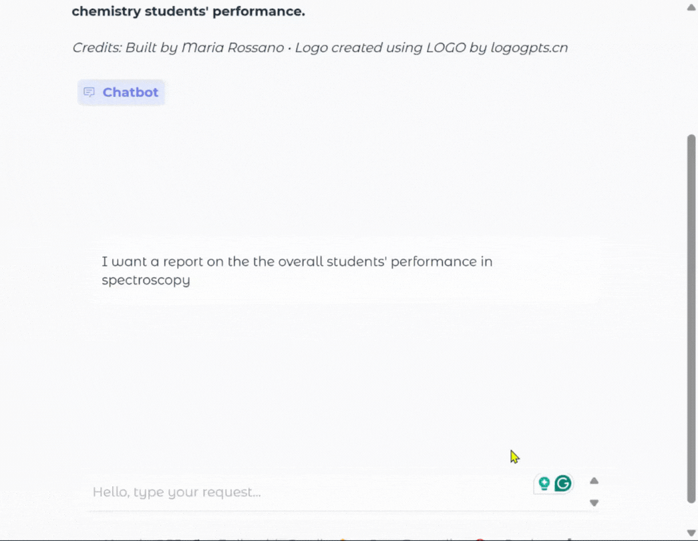

# **Agent for Assisting in the Extraction of Information of Student's Performance Comments Provided in Natural Language**
Authors:
- [Maria Rossano](https://github.com/rossanot)

This agent was envisioned as an assistant to help in frequent and common tasks performed within academic settings. For now, the system is capable of extraction insights from tabular data and return it in the form of a natural language response.


The agent is comprised by:
- An API that requests data about holidays within Canada used in the suggestion of meetings.
    - Calls are requested from [Calendarific](https://calendarific.com/api-documentation)
- A function call tool to obtain the current date.
- A semantic query using a ChromaDB instance with file persistance.
    - The dataset, in jsonl format, was synthetically created using CHATGPT 5 for the sake of developing a proof-of-concept. 
        > **Prompt used to generate the dataset**
        >
        > (1) create a small dataset in json format of 10 examples containing the following: student_id, student_name (one first and one last name only), comments on the student's performance in class (it's a chemistry class), parent email, teacher's name (only one teacher)
        > 
        > (2) Actually, I want the comments to be more detailed
    - The dataset contains information of students performance. It mimics an external evaluation performed on the students
    - The embedding used the `text-embedding-3-small` model as used in class. It consisted of the following steps:
    - (a) Creating a JSONLoader object as the data was in jsonl format
    - (b) Extracting two pieces of information as a str from the dataset, `student_name` and `comments`
    - (c) Obtaining embeddings for the text obtained from (b)
    - (d) Creating a ChromaDB collection
    - (e) Obtaing embeddings for the user prompt during the creation of the final prompt and obtaining a resulting proximity match with respect to the data in the dataset (in the ChromaDB collection)
- A user interface was implemented using Gradio, as shown below.

<div id="fig-6" align="center">
  
  <div style="text-align:justify; max-width:600px; margin:auto;">
    <b>Fig 1.</b>Interactive gradio UI to interact with the Agent. (Animated demo.)
  </div>
</div><br />


- A series of sample prompts are provided in the project directory. In addition, a smaple prompt is provided in the Gradio UI.


## **How to use**
```bash
python 05_src/assignment_02/chat_app/app.py
```
